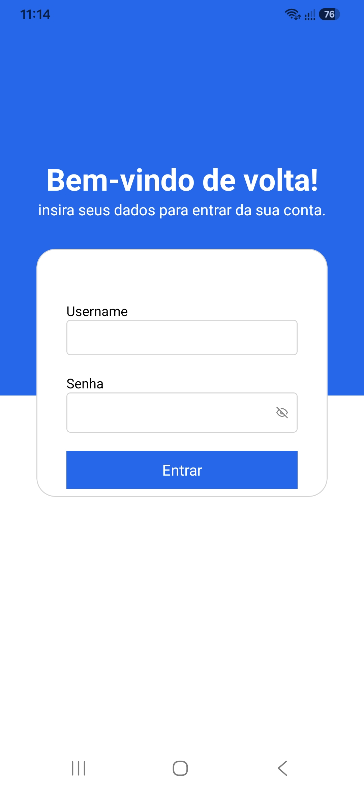
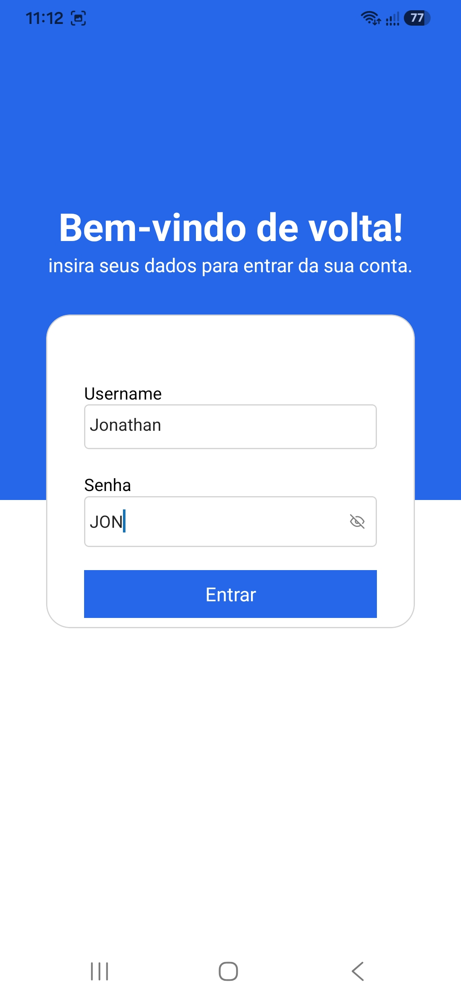
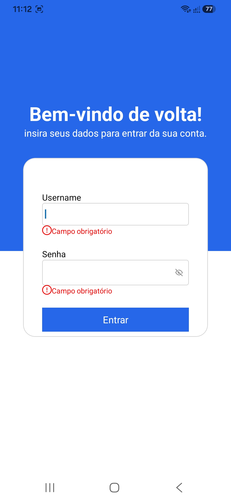
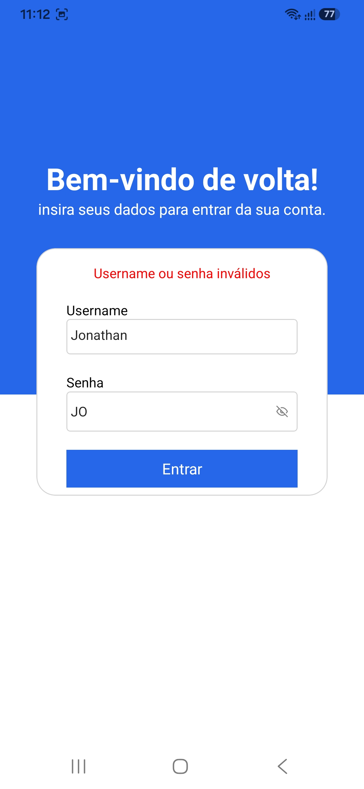
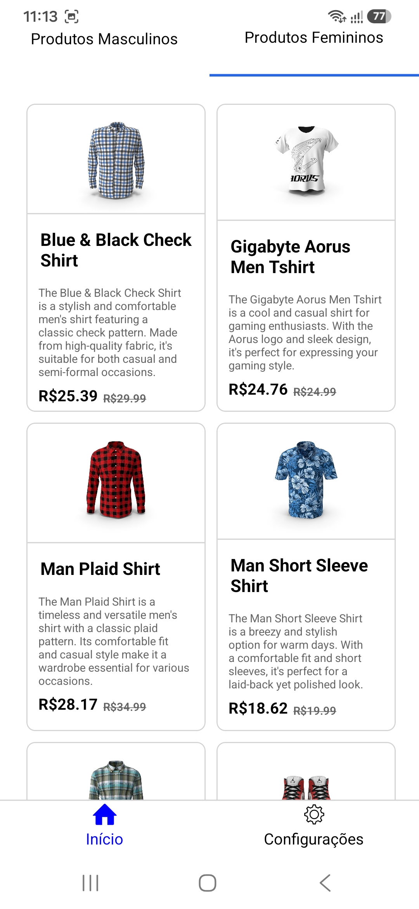
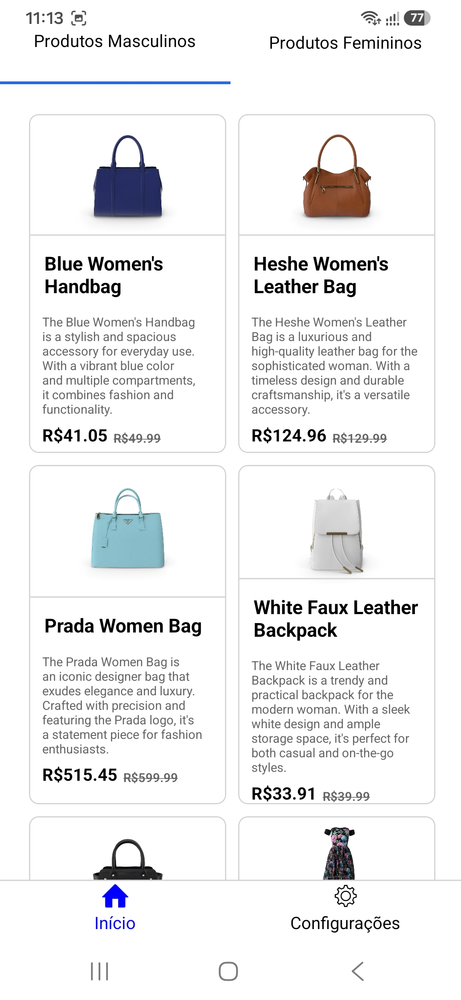
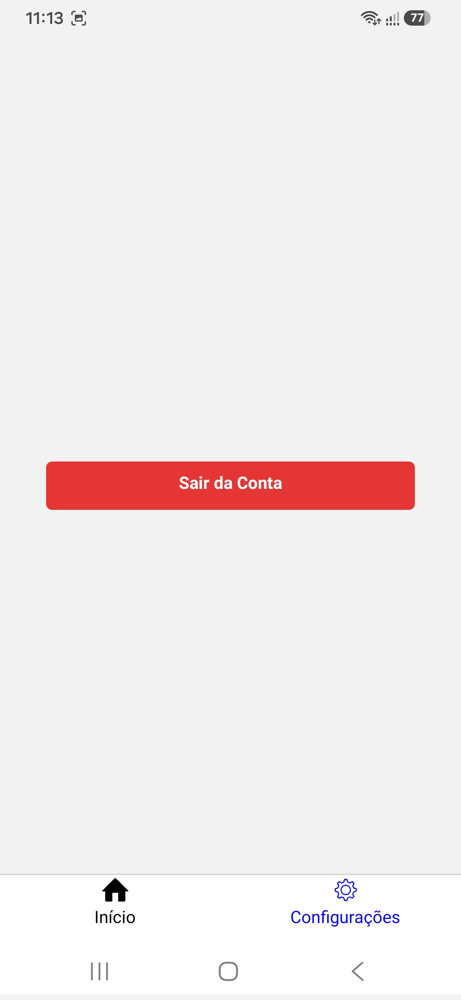
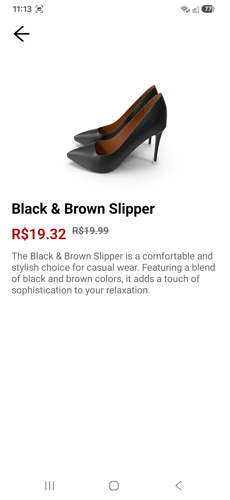

# Bem vindo! ao meu aplicativo Expo

Este é um projeto [Expo](https://expo.dev) criado com [`create-expo-app`](https://www.npmjs.com/package/create-expo-app).

## Começando

1. Crie as environments
    - crie um arquivo `.env` em  `SHOP-APP`
    - insira as environments
      ```bash
      EXPO_PUBLIC_API_URL=https://dummyjson.com/products/
      EXPO_PUBLIC_API_CATEGORI_MENS_LIST=["mens-shirts","mens-shoes","mens-watches"]
      EXPO_PUBLIC_API_CATEGORI_WOMENS_LIST=["womens-bags","womens-dresses","womens-jewellery","womens-shoes","womens-watches"]
      ```

2. Instale as dependências

   ```bash
   npm install
   ```

3. Inicie o aplicativo

   ```bash
   npx expo start
   ```

Na saída você encontrará um QRCODE, você poder usar o aplicativo `Expo Go` para ler o QRCODE ou seguir com `a` para abrir o emulador conforme mostrara as as opções:

 - [development build](https://docs.expo.dev/develop/development-builds/introduction/)
 - [Android emulator](https://docs.expo.dev/workflow/android-studio-emulator/)
 - [iOS simulator](https://docs.expo.dev/workflow/ios-simulator/)
 - [Expo Go](https://expo.dev/go), um sandbox limitado para testar desenvolvimento de aplicativos Expo

## API

Esse aplicativo está consumindo a API: [`dummyjson.com/products`](https://dummyjson.com/products/)

## Protótipo

o aplicativo segue o seguinte portótipo: [`Protótipo Figma`](https://www.figma.com/design/Nbrwqt89RN9cvPYHDF08pu/Portfolio-Mobile-development?node-id=0-1&t=YhfW02RMFrQTLjOf-1)

## Tecnologias utilizadas

 - React Native (Expo)
 - Axios
 - Redux Toolkit
 - TypeScript
 - React Navigation
 - Styled Components
 - React Query
 - Async Storage (expo-secure-store / @react-native-async-storage/async-storage)
 - ESLint
 - Prettier

## APP images
As imagens do app estão em `doc/prints`:
<p align="center">
   &nbsp;
   &nbsp;
   &nbsp;
   &nbsp;
   &nbsp;
   &nbsp;
   &nbsp;
   &nbsp;
  
</p>

## PDF DOC
PDF contendo o fluxo do aplicativo
[`PDF do app`](doc/shop-app-funcionalidades.pdf)